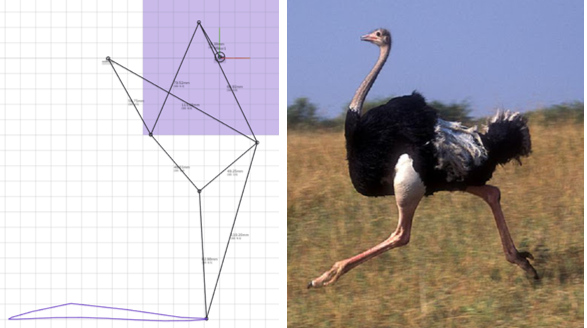
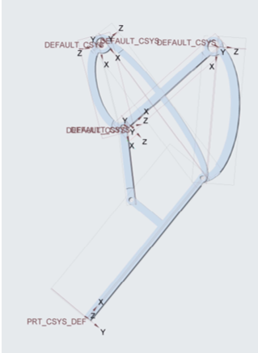
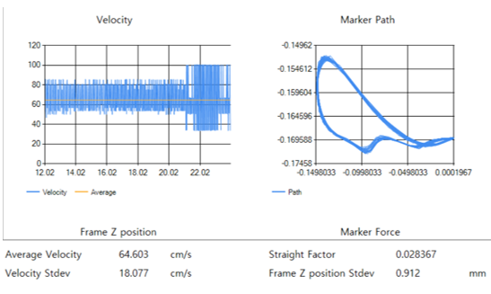
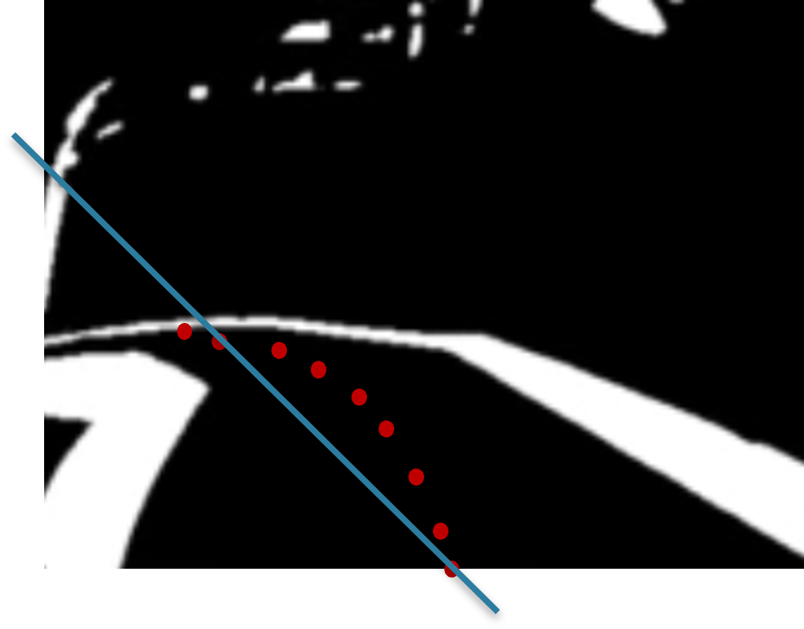

# self-walking_robot

## Final video

## Procedure

### Mechanism design

* Used walking mechanism of ostrich to design a walking mechanism of robot
  

* 3D design

* V-rep simulation video

* result

### Image Processing & Decision Making

* Made image gray by a threshold.
* Found the center point of the road then used MSE linear regression to decide direction of the robot.

## Limitations
* I've made image gray by a constant threshold value, so it can't be used in outdoor nor where the light is weak.
* I've failed to reduce the friction between the bar and the leg of the robot. 
* Since there are so many surfaces making the friction, it is hard to find which one is making high friction.

## What I've learned
* It was hard to know whether the problem was in the hardware or software whenever something went wrong.
* So I've learned that software should be tested based on solid hardware.
* It was my first project using programming language, so I'd lots of difficulties during the project. 
* But when I finally finished the project, I felt so good about my self and felt like I grew-up.

